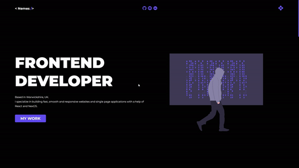

# Portfolio

> Personal portfolio showcasing my projects and skills.
> [_See live_](https://www.olivernemes.co.uk).

## Table of Contents

- [Technologies Used](#technologies-used)
- [Features](#features)
- [Screenshots](#screenshots)
- [Project Status](#project-status)

## Technologies Used

- framer-motion - version 4.1.17
- next - version 11.1.2
- react - version 17.0.2
- react-dom - version 17.0.2
- styled-components - version 5.3.1

## Features

- Smooth page transitions.
- Custom Design. [_See Figma sketch_](https://www.figma.com/file/Qw1VSK0TFSXaBPn616aFfj/Portfolio-example-2?node-id=0%3A1).
- No CSS libraries used.

## Screenshots

## Project Status

_Complete_ .
